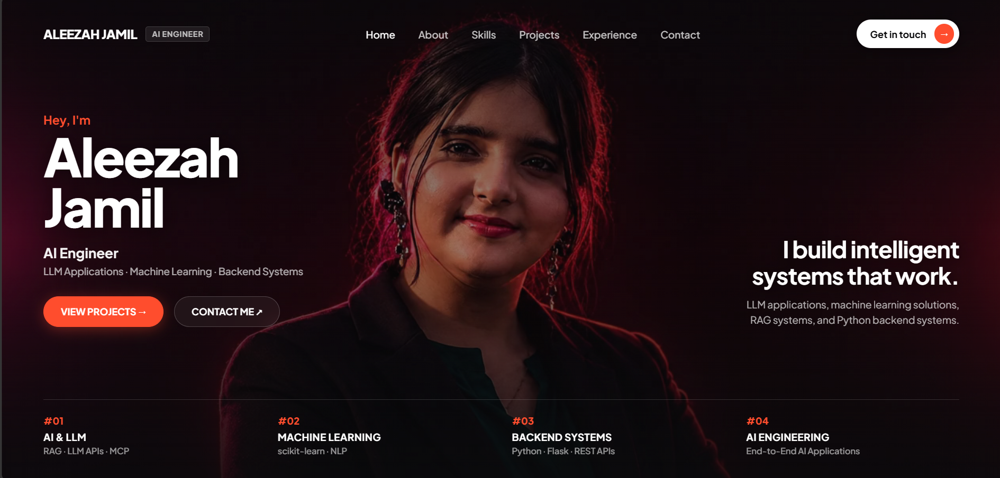
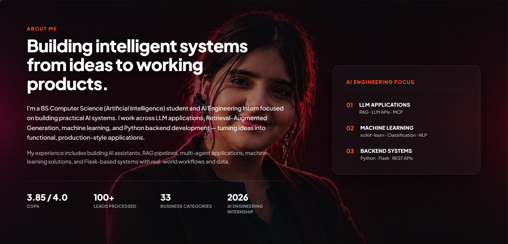
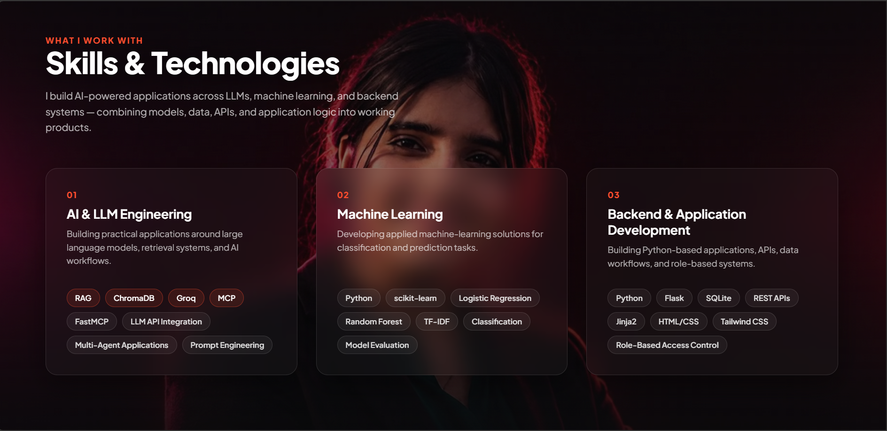
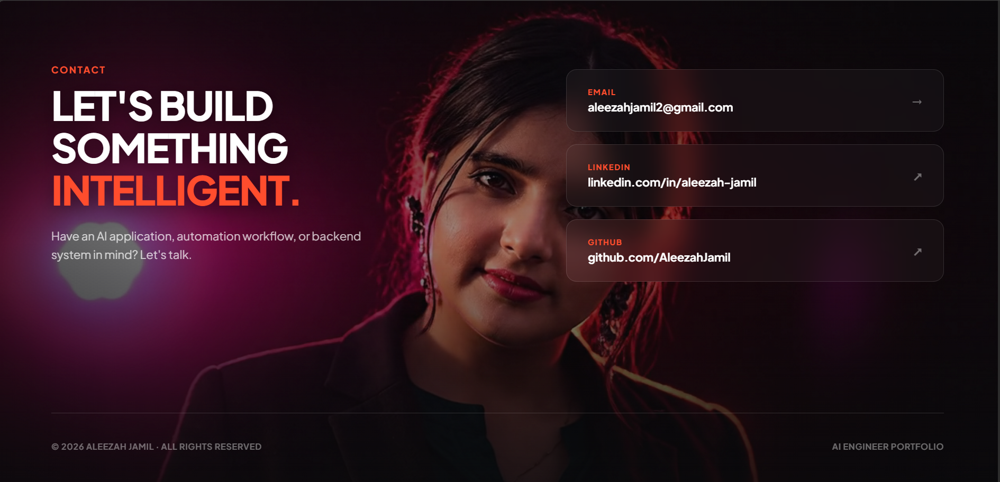

# Aleezah Jamil — AI Engineer

AI Engineer specializing in **LLM applications, AI-powered systems, and backend development**.

This repository contains my personal portfolio website, showcasing selected projects, technical skills, and experience building practical AI solutions.

---

## About

I’m an AI Engineer focused on designing and developing intelligent applications that combine modern AI technologies with reliable backend systems.

My areas of interest include:

- Large Language Model (LLM) Applications
- Retrieval-Augmented Generation (RAG)
- AI/ML Systems
- Backend Development
- AI-powered Automation
- API Integration

---

## Selected Projects

### CareFlow
An AI-powered healthcare application focused on improving workflows through intelligent automation and assistance.

### B2B/B2C Lead Generation Platform
A lead generation platform supporting both B2B and B2C workflows, featuring an end-to-end application flow and AI-driven functionality.

### RAG Knowledge Assistant
A Retrieval-Augmented Generation application designed to retrieve relevant information and provide context-aware responses from a knowledge base.

### Smart Expense Categorizer
An AI-powered application that automatically categorizes and organizes financial expenses.

### AI Medical Assistant
An AI application designed to provide users with accessible medical information and intelligent assistance.

### Weather App
A web application providing weather information through a simple and responsive interface.

---

## Technical Skills

**AI & Machine Learning**
- Large Language Models
- Retrieval-Augmented Generation (RAG)
- AI Application Development
- Machine Learning

**Development**
- Python
- JavaScript
- Backend Development
- REST APIs
- API Integration

---

## Portfolio Screenshots

### Hero


### About


### Skills


### Contact


---

## Project Structure

```text
Aleezah-Portfolio/
├── index.html
├── frames/
│   ├── scene00001.png
│   ├── scene00002.png
│   ├── ...
│   └── scene00115.png
├── Screenshots/
│   ├── Hero.png
│   ├── about.png
│   ├── skills.png
│   └── Contact.png
├── .gitignore
└── README.md
